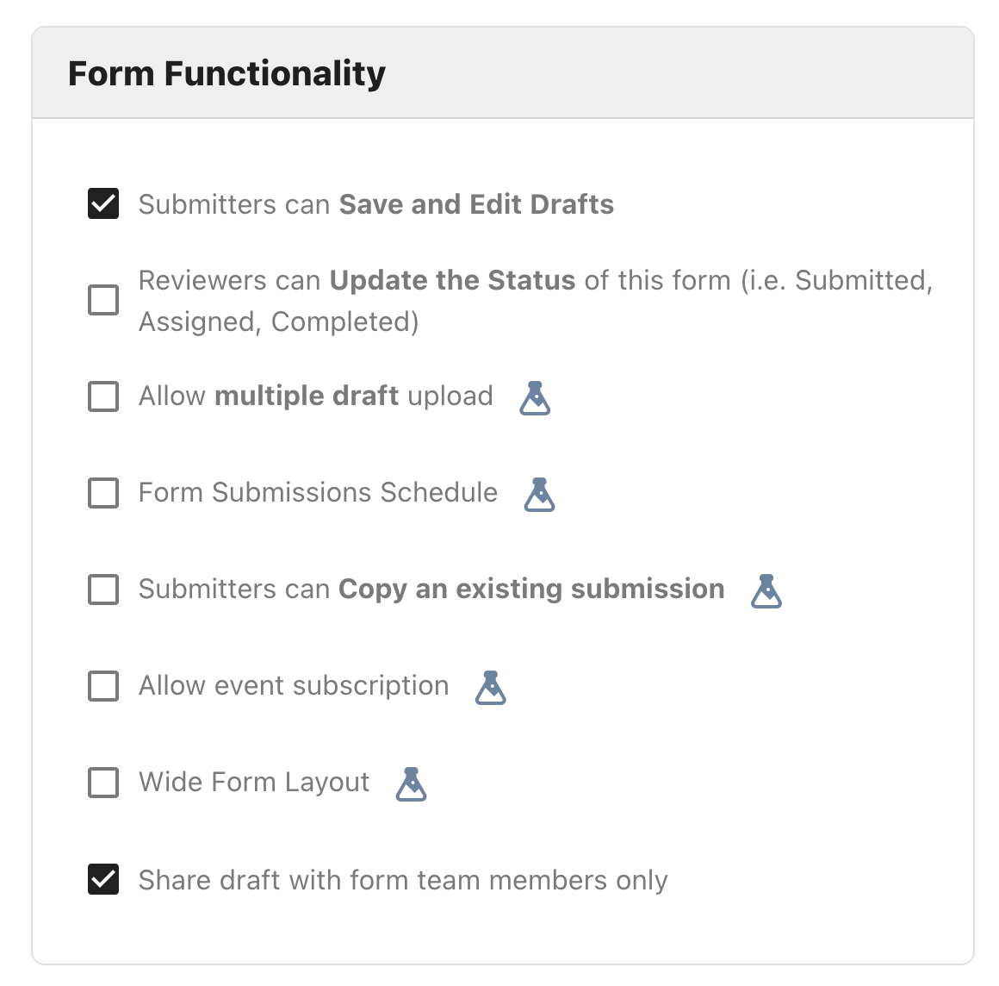
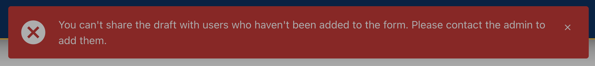
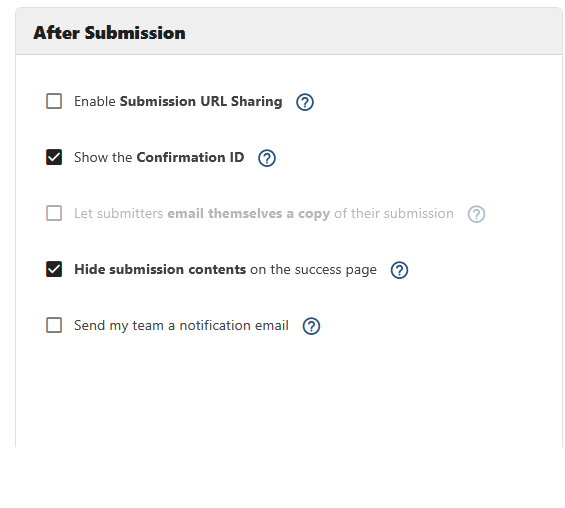
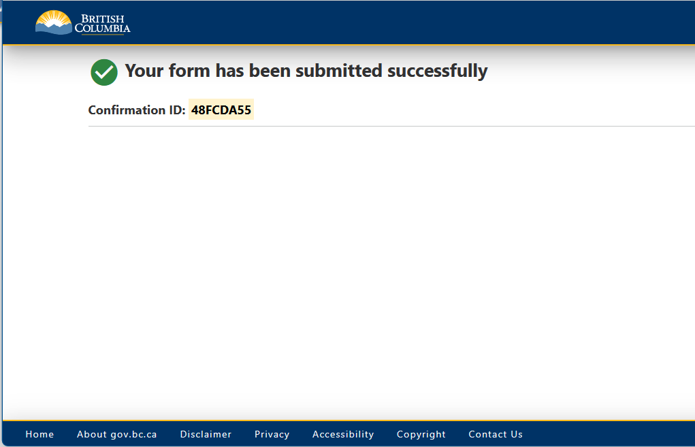

[Home](index) > [Capabilities](Capabilities) > [Form Management](Form-Management) > **Sharing a submission**
***

This feature allows a group of people to fill in a submission.

<!-- **On this page:**
* [Enable submission sharing in the form settings](#Enable-submission-sharing-in-the-form-settings)
* [How to share a submission](#How-to-share-a-submission) -->

## Enable submission sharing in the form settings
To enable shared submissions, the form owner must select the check box for "Enable submitters of this form to Save and Edit Draft submissions" in the form's settings.

## How to share a submission

The person filling in the form can invite team members to edit it when it is a draft. They invite your team members by clicking the "Manage Team Members" icon.

* The team member needs to have already logged in to CHEFS for you to find them in this search
* The submitter enters the team member's name, email, or username
* The submitter needs to copy the submission URL and send it to their team member(s).

Once the form is submitted, they cannot edit anymore.  

## Restricting Access to Form Team Members

By selecting the form setting "Share draft with form team members only", draft submissions can only be shared with those users who have been added to the form team.

You will be presented with an error when attempting to add a non-team user.

## Controlling who can view a submission

The **After Submission** panel of Form Settings has five checkboxes that together control who can see a submission and what appears on the success page after a form is submitted. Three of these are new; one has been narrowed in meaning. The URL Sharing and email-receipt options are meaningful only on **Public** forms; on all other form-access types the anonymous viewing they control does not exist in the first place, and those checkboxes are greyed. "Hide submission contents on the success page" applies to any form.

> **Note:** The previous single "Show the submission confirmation details" checkbox has been split into two independent checkboxes: **"Show the Confirmation ID"** and **"Let submitters email themselves a copy of their submission"**. Either one can now be toggled on its own.
>
> **Default for new forms:** Submission URL Sharing is **on**, Show the Confirmation ID is **on**, Let submitters email themselves a copy is **on**, and Hide submission contents on the success page is **off**. A brand-new form therefore behaves the same as a form did before this change.
>
> **Existing forms (created before this change):** Submission URL Sharing is on, so they continue to behave exactly as before. Whichever way "Show the submission confirmation details" was previously set, both of the new split checkboxes inherit that value; nothing about the success page changes until the form designer opts in to the new privacy controls.

## The five "After Submission" settings

| Setting | Default | When it applies | What it controls |
|---|---|---|---|
| **Enable Submission URL Sharing** | On | Public forms only | When off, only the submitting browser (and form team members) can view the submission via `/form/success?s=...`. Anyone else who obtains the URL sees a static confirmation block. |
| **Show the Confirmation ID** | On | All forms | Displays the submission's unique Confirmation ID on the success page. Independent of URL Sharing. |
| **Let submitters email themselves a copy of their submission** | On | All forms; auto-off and greyed when URL Sharing is off | Shows the "email me a copy" widget on the success page. |
| **Hide submission contents on the success page** | Off | All forms | When on, the success page never displays the read-only copy of the submission to any viewer, including authenticated form team members opening the success URL. Form team members still see submissions through the Submissions management screen. |

### For form designers

Open **Manage Form > Form Settings** (pencil icon) and expand the **After Submission** panel. The five checkboxes are grouped together.

- The "Enable Submission URL Sharing" checkbox is disabled on non-Public forms; anonymous URL access does not exist on those form types.
- Turning "Enable Submission URL Sharing" off automatically unchecks and greys "Let submitters email themselves a copy of their submission". The email receipt links back to the success page, which the recipient would not be able to open, and forwarding the receipt to a group alias would defeat the point of restricting URL sharing.
- Turning "Enable Submission URL Sharing" back on does not restore the email-receipt checkbox; re-enable it if you want that behavior.
- "Show the Confirmation ID" is fully independent of the other checkboxes; you can leave it on for a locked or content-hidden form.
- "Hide submission contents on the success page" is independent of all the others and can be combined with any of them.

### What each viewer sees when URL Sharing is off

- **The submitting browser (immediately after submitting):** still sees the full submission on the success page for that browsing session.
- **Anyone opening a forwarded URL, or the submitter returning to the URL after closing the tab:** sees only the success header, plus the Confirmation ID if that checkbox is on. No submission contents. No error message.
- **Authenticated form team members:** see the submission normally, both on the success page and in the Submissions management screen.

### What each viewer sees when "Hide submission contents" is on

No viewer sees the read-only copy of the submission on the success page: not the submitter, not a forwarded viewer, and not an authenticated form team member opening the success URL. The form team continues to see full submissions through the Submissions management screen. This option is orthogonal to URL Sharing and can be combined with it.

***
[Terms of Use](Terms-of-Use) | [Privacy](Privacy) | [Security](Security) | [Service Agreement](Service-Agreement) | [Accessibility](Accessibility)