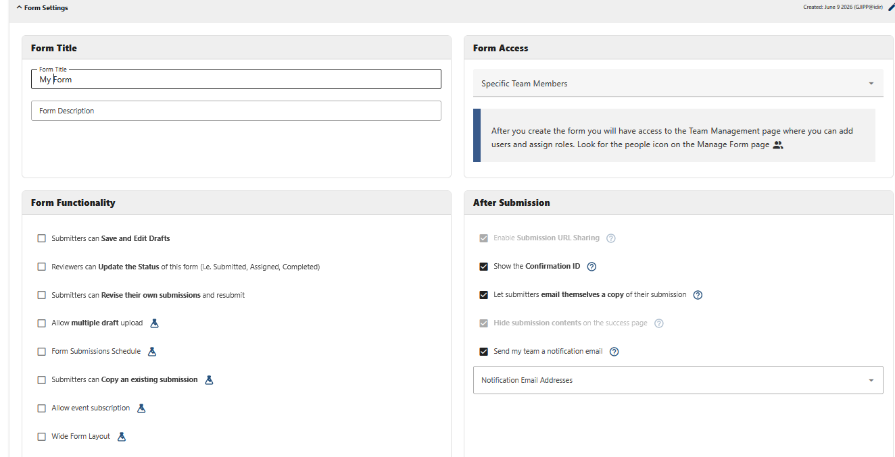

[Home](index) > [Capabilities](Capabilities) > [Functionalities](Functionalities) > **Notifications and Reminders**
***

<!-- ## Notifications: -->
<!-- 
* [Submission Success Confirmation for Team Members](#Submission-Success-Confirmation-for-Team-Members)
* [Submission Confirmation for Submitters](#Submission-Confirmation-for-Submitters)
* [Status Change Notifications](#Status-Change-Notifications)
* [Draft Invitation for Team Members](#Draft-Invitation-for-Team-Members) -->

## Submission Success Confirmation for Team Members

Form owners have the option to set up email notifications for team members whenever a submission is successful. These notifications can be enabled when the form is initially created or later through the form settings. 

Team members' email addresses must be manually added to the appropriate field to receive notifications.

<!--
TODO (CCP-4720): the noti1.png screenshot below is out of date.

The "After Submission" panel now shows four checkboxes instead of two:
  - Enable Submission URL Sharing
  - Show the Confirmation ID   (renamed from "Show the submission confirmation details")
  - Let submitters email themselves a copy of their submission
  - Hide submission contents on the success page

Recapture noti1.png on the current build. This section's copy is fine as-is
(it is only about the team-notification email, which is unchanged), but the
screenshot must be updated so it does not show the old checkbox label. See
docs/Capabilities/Form-Management/Sharing-a-submission.md for the new options.
-->

## Submission Confirmation for Submitters
<!-- **[Back to top](#top)** -->

After successfully submitting a form, submitters have the option to send themselves a confirmation email that serves as a receipt for their records. This option is shown on the success page when the form owner has left **"Let submitters email themselves a copy of their submission"** on in Form Settings. On a Public form where **"Enable Submission URL Sharing"** has been turned off, the email-receipt option is automatically off (see [Sharing a submission](Sharing-a-submission) for the interaction rules).

<!--
TODO (CCP-4720): confirm noti2.png is still representative of the default
success page. On a brand-new form (all four "After Submission" checkboxes at
their defaults) the button, Confirmation ID, and submission contents should
still render as shown, so the screenshot is likely fine. Recapture only if
the success-page layout has changed cosmetically on the current build.
-->

## Status Change Notifications
<!-- **[Back to top](#top)** -->

Email notifications will be sent whenever the Reviewer changes the status of a submission. The specific notifications depend on the status change:

### Completed Status: 

If the status is changed to "Completed," the person who submitted the submission will be automatically notified.

### Revising Status: 

If the status is changed to "Revising," the Reviewer has the option to notify either the initial drafter or another person who was involved in the draft.

After selecting the "Revise" option, the recipient will receive the following email notification:

### Assigned Status: 

If the status is changed to "Assigned," the Reviewer can only send notifications to other reviewers who have been added to the form.

After selecting the reviewer, the recipient will receive the following email notification:

## Draft Invitation for Team Members
<!-- **[Back to top](#top)** -->

The submitter can invite other team members to collaborate on the form draft. To add members, the submitter should click on the team members icon located in the top right corner after saving the initial draft.

Once the submitter selects a specific identity provider and adds members who will be working on the draft, CHEFS  will send an invitation email with the following content:

If the submitter chooses to remove an added member, CHEFS will notify that member that they have been removed from the form draft.

***
[Terms of Use](Terms-of-Use) | [Privacy](Privacy) | [Security](Security) | [Service Agreement](Service-Agreement) | [Accessibility](Accessibility)