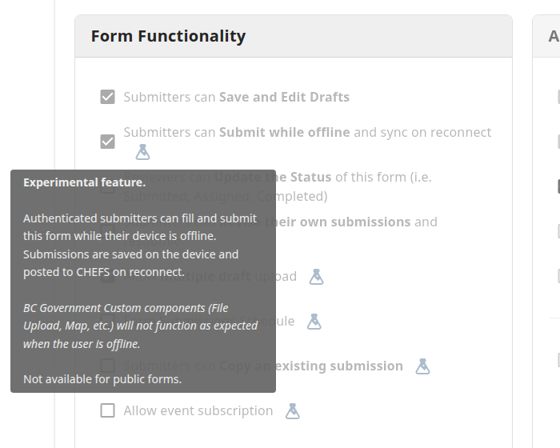
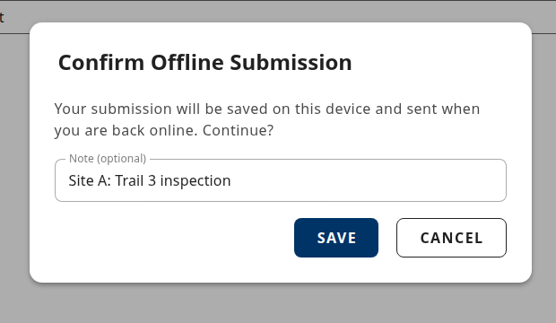
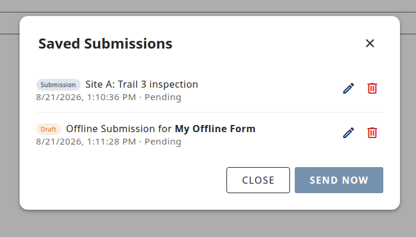
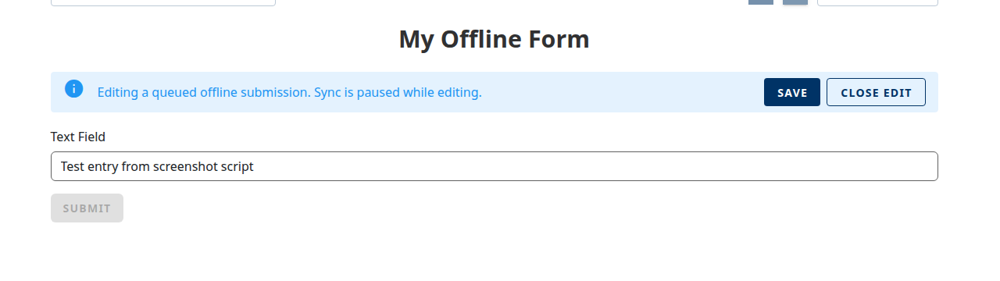
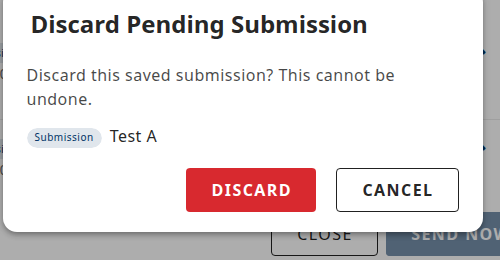
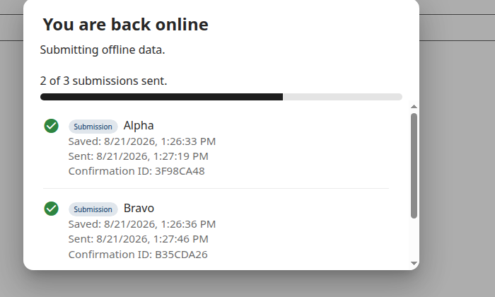
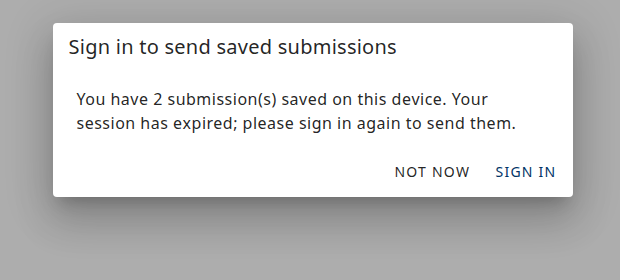

[Home](index) > [Capabilities](Capabilities) > [Functionalities](Functionalities) > **Offline Submissions**
***

# Offline Submissions

> **Offline Submissions is currently only available by request.** If you would like to enable Offline Submissions for your form, please contact us on the [CHEFS Teams channel](https://teams.microsoft.com/l/channel/19%3A34b9d4b4deb54eebaa9be8bc1ccf02f7%40thread.tacv2/CHEFS%20(Exchange%20Lab%20Team)?groupId=bef8086f-20c7-43a4-bd07-29ce764e818c&tenantId=6fdb5200-3d0d-4a8a-b036-d3685e359adc).
>
> Please be aware that this is an experimental feature and although it has been tested as functional, it may not behave as expected in all scenarios yet. Your input is more than welcome to help us improve it.

## Overview

Offline Submissions lets **authenticated submitters** continue filling and submitting a form when their device is not connected to the internet. Entries are saved on the device and sent to CHEFS automatically once the device is back online. This is useful for field work, remote sites, and any situation where connectivity comes and goes.

---

## When to use it

Turn Offline Submissions on for forms that will be filled out in the field or in places where connectivity is unreliable, such as:

- On-site inspections and audits
- Remote or rural field work
- Any authenticated form where submitters may lose their connection mid-form

Leave it off for public-facing intake forms, forms that rely on custom BC Government components, or forms that must be received by the server immediately.

---

## Enabling the feature

1. Open your form's **Settings**.
2. In the **Form Functionality** panel, tick the checkbox labelled **"Submitters can Submit while offline and sync on reconnect"**.
3. Hover the flask icon next to the label for the in-app summary.
4. Save the form settings.

---

## Requirements and restrictions

### The submitter must be signed in

Offline Submissions is only available on forms that require sign-in. Set **Form Access** to an authenticated option (IDIR, BCeID, or a mix); it does not work with *Public* access.

### BC Government custom components do not work offline

**The custom BC Government form components require an internet connection because they reach other systems in government.** These components will not function while the submitter is offline:

- **File Upload** (files cannot be attached until the device is back online).
- **BC Address** (looks up addresses from a BC Government address service).
- **Map** (loads map tiles and base data from a hosted map service).
- **OrgBook** (looks up businesses from the BC OrgBook registry).
- **IDIR Users** (looks up staff from the BC Government directory).

Standard form fields (text, number, date, radio, select, checkbox, text area, panels, columns, and so on) work normally while offline.

If your form relies on any of the components above, plan your form so those fields are filled in while the submitter is online, or accept that offline submitters will not be able to complete those fields until they reconnect.

---

## What submitters see while offline

Once you enable the feature and the submitter loads the form, CHEFS adds a persistent connection status chip to the top of the page.

- When online, the chip shows a green cloud icon and the label **ONLINE**.
- When offline, the chip changes to a warning icon with the label **Offline**.
- If any submissions are waiting on the device, a red count badge appears on the corner of the chip.

While offline, some form controls change:

- **View my Drafts / Submissions** and the multi-draft upload switch grey out; those pages need the server.
- **Print options**: Browser Print stays available. **Template Print** (CDOGS-rendered downloads) is disabled offline; it needs the server to render the template.
- **Save as Draft** stays available; drafts are also saved on the device and sent later.
- **Submit** works, but instead of posting to the server it opens the confirmation dialog below.

When the submitter clicks Submit while offline, CHEFS opens a dialog:

- Title: **Confirm Offline Submission** (or **Confirm Offline Draft** for a draft).
- Message: *"Your submission will be saved on this device and sent when you are back online. Continue?"*
- Optional **Note** field (up to 100 characters) so the submitter can label the entry to find it later.
- Buttons: **Cancel** and **Save**.

After saving, a toast confirms the entry was stored on the device and the form resets to a fresh state so the submitter can start the next entry.

---

## Managing saved submissions

Clicking the status chip opens the **Saved Submissions** list.

Each row shows:

- A small tag that reads **Submission** (primary colour) or **Draft** (warning colour).
- The submitter's optional note. If they left it blank, CHEFS uses the default *"Offline Submission for [form name]"*.
- The local date and time the entry was saved.
- The current status: **Pending**, **Syncing…**, or a specific failure reason (see [Failed entries](#failed-entries) below).

Each row has an **Edit** (pencil) and a **Discard** (trash) button; see the subsections below.

At the bottom of the modal, **Send now** manually triggers a send while online. It is disabled while the device is offline, when the list is empty, and while a send is already running.

### Editing a saved entry

Click the pencil icon on any row. The form reopens with the saved data pre-filled and an info banner appears above it.

- Change the values you need to correct.
- Click **Save** in the banner (or run through the submit flow) to overwrite the entry in place. The entry keeps its original save time and its place in the queue.
- Click **Close Edit** to leave without changing anything.

Sync is paused while an entry is being edited, so a queued send cannot overwrite your changes mid-edit.

### Discarding a saved entry

Click the trash icon on the row. A confirmation dialog opens showing which entry will be removed.

Click **Discard** to remove it, or **Cancel** to keep it. Discarding cannot be undone.

---

## Sync on reconnect

CHEFS checks reachability by periodically pinging the server, not only by reading the browser's *online* flag. Reconnection is noticed within roughly five to twenty seconds.

Once the device is back online:

1. CHEFS opens a **You are back online** progress dialog with the subtitle *"Submitting offline data."*
2. Each saved entry moves from Pending, through Syncing, to either **Sent** (with a Confirmation ID when the form issues one) or **Failed** (with a plain-language reason).
3. The dialog stays open while sending is in progress. When the drain is finished, a Close button appears; the submitter chooses when to close it.

**Confirmation IDs and email receipts are issued at send time**, not when the entry was saved on the device. If your form has *Show Submission Confirmation* on, the Confirmation ID appears against each successfully sent row in the progress dialog.

### If the sign-in has expired

If the sign-in has expired when saved entries try to send, CHEFS opens a **Sign in to send saved submissions** dialog with a **Sign In** button. After signing in again, CHEFS asks whether to send the saved submissions now, and continues from where it left off.

---

## Late replays and scheduled forms

A submission saved on the device **before** the form's scheduled close date is treated as on-time even if it syncs after the window closes. The audit record keeps the moment the submitter pressed Save on their device, not the moment the server received the entry.

---

## Failed entries

If sending fails for a reason that will not clear itself, the entry stays in the Saved Submissions list with an explanation. The submitter can edit and retry, or discard the entry. Possible reasons:

- **Sign-in expired** while sending. The submitter needs to sign in again.
- **Permission removed** on the form since the entry was saved.
- **Saved by another user** on this device. This blocks accidentally sending someone else's saved entry from a shared browser session.
- **Form version no longer available**. The form was withdrawn or replaced.
- **Server-side validation failure**. The submitter needs to edit and correct the entry before it can be sent.

---

## Limits and things to know

- **Same browser, same tab.** Closing the tab and reopening from cold while still offline is not supported. Keep the form tab open until the device is back online.
- **Per-device, per-user queue.** Saved entries live in the current browser on the current device. Teammates and other devices do not see them.
- **50 saved entries per form per device.** After the limit, further attempts to save show *"You have reached the offline submission limit (50) for this form. Reconnect and sync before queuing more."*
- **Unencrypted local storage.** Saved entries live in browser storage (IndexedDB) with no encryption at rest. Avoid using Offline Submissions for highly sensitive data on shared or unmanaged devices.
- **Private / incognito browsing** and locked-down browser profiles can disable local storage. CHEFS then shows *"Offline submission isn't available in this browser (local storage is disabled). Submissions require an active connection."* and the feature is not available in that session.
- **No cross-browser or cross-device queue.** Entries saved in Chrome on a laptop do not appear in Firefox on the same laptop, or on a phone.

---

## FAQ

**Does the submitter get a Confirmation ID right away?**
No. Confirmation IDs and email receipts are issued at send time, not when the entry was saved on the device. The Confirmation ID appears in the sync progress dialog once the entry has been sent.

**Does Save as Draft work offline?**
Yes. Drafts are saved on the device the same way submissions are, and are sent when the device is back online.

**Can several submitters share one device's queue?**
No. The saved list is tied to the signed-in submitter. Entries saved by a different account are marked so they cannot be sent from another account by mistake.

**What happens if the submitter closes the tab?**
Saved entries persist in the browser. Reopening the same browser on the same device shows them again. Reopening in a different browser (or on a different device) will not.

**Do the BC Government custom components work offline?**
No. File Upload, BC Address, Map, OrgBook, and IDIR Users all need an internet connection because they reach other government systems. Those fields will not work correctly until the submitter is back online.

***
[Terms of Use](Terms-of-Use) | [Privacy](Privacy) | [Security](Security) | [Service Agreement](Service-Agreement) | [Accessibility](Accessibility)
