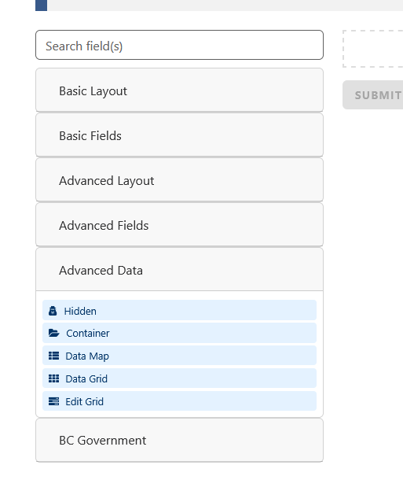
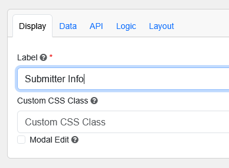
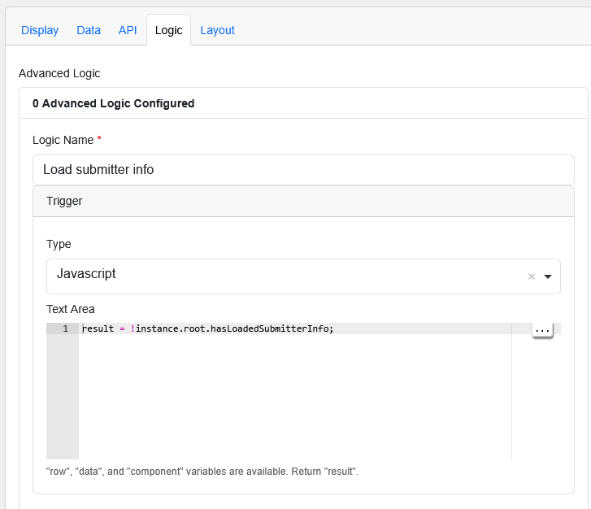
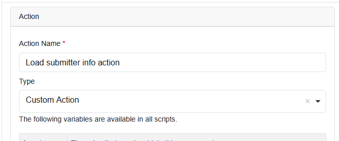
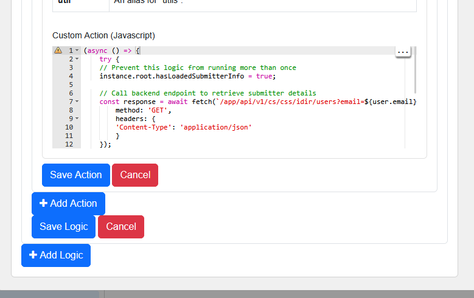

# Hidden Component: Auto‑Loading Submitter Info

This tutorial shows how to automatically retrieve the currently logged‑in user’s information from the backend and store it inside a **Hidden** component. This is useful when you want to attach submitter metadata to a form submission without exposing it to the user.

---

## 1. Add a Hidden Component

Drag a **Hidden** component onto your form.



### Display Tab

- **Label:** `Submitter Info`



---

## 2. Add Logic to Load Submitter Info

Open the **Logic** tab for the `submitterInfo` component.

### Step 1 — Add a Logic Rule

- Click **Add Logic**
- **Logic Name:** `Load submitter info`
- **Trigger Type:** `JavaScript`

Paste the following into the JavaScript trigger:

`result = !instance.root.hasLoadedSubmitterInfo;`

This ensures the logic runs **only once**, even though Form.io may re-render components multiple times.



---

### Step 2 — Add a Custom Action

- Click **Add Action**
- **Action Name:** `Load submitter info action`
- **Action Type:** `Custom Action`



Paste the following into the **Custom Action (JavaScript)** editor:
```
(async () => {
    try {
    // Prevent this logic from running more than once
    instance.root.hasLoadedSubmitterInfo = true;

    // Call backend endpoint to retrieve submitter details
    const response = await fetch(`/app/api/v1/cs/css/idir/users?email=${user.email}`, {
        method: 'GET',
        headers: {
        'Content-Type': 'application/json'
        }
    });

    if (!response.ok) return;

    const responseData = await response.json();

    // Store the retrieved user object in the hidden component
    instance.setValue(responseData.data[0]);
    } catch (e) {
    console.error(e);
    }
})();
```



- Click **Save Action**
- Click **Save Logic**
- Click **Save** to add the component to the form

---

## 3. Save and Test

Open **Form Preview** to verify that:

- The hidden field is populated automatically  
- The network request fires only once  
- The submission includes the `submitterInfo` object  

You can inspect the submission JSON to confirm the hidden field is populated correctly.