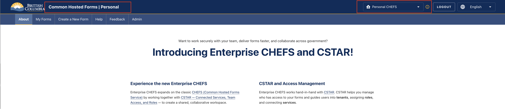
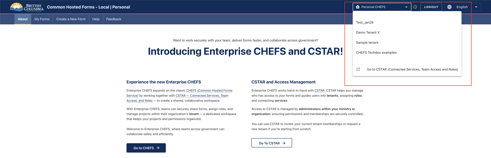
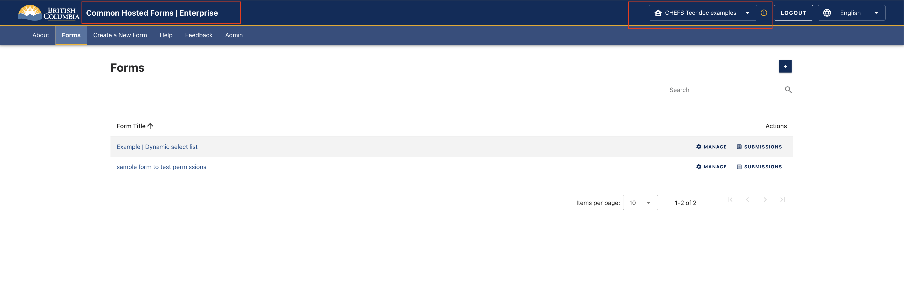

[Home](../index) > [Enterprise CHEFS](index) > **Features and Use Cases**
***

## Landing Page

When a user navigates to the Enterprise CHEFS URL, they land on a page that introduces both Enterprise CHEFS and CSTAR. The page provides two entry points:

- **Go to CHEFS** — takes the user into the forms application
- **Go to CSTAR** — takes the user to the CSTAR tenant management portal

The landing page also displays an important notice for BCeID users: BCeID users must log in to CSTAR before using Enterprise CHEFS. This step ensures their account is discoverable by tenant admins who need to add them to a tenant or group.

## Logging In

Users log in by clicking the **Login** button on the landing page. Authentication is done through IDIR. Once authenticated, an API call is made to CSTAR to fetch all tenants the logged-in user belongs to.

---

## Personal CHEFS vs Enterprise CHEFS

### Default State — Personal CHEFS

After logging in, the application defaults to Personal CHEFS. The top navigation bar displays **Common Hosted Forms | Personal**, and the top-right dropdown shows Personal CHEFS selected. This is the classic CHEFS experience — forms are personal and not associated with any tenant.

If the user does not belong to any tenants in CSTAR, the experience is identical to Personal CHEFS with no visible difference.

### Switching to a Tenant

If the user belongs to one or more tenants, those tenants are listed in the top-right dropdown alongside Personal CHEFS. Clicking a tenant switches the application to that tenant's context.

When a tenant is selected:

- The navigation bar updates to show **Common Hosted Forms | Enterprise**
- The Forms page now lists forms that belong to the selected tenant
- CSTAR is called in the background to retrieve the user's groups and roles within that tenant
- All roles from all groups are aggregated and applied across all forms in the tenant

---

## Roles and Permissions

Roles come from CSTAR. A user can belong to multiple groups within a tenant, and each group can have one or more service roles assigned to it. All roles from all groups are aggregated and applied uniformly across every form in the tenant.

**Example:** A user in two groups — one with `submission_reviewer` and another with `form_submitter` — will have both roles on all forms in that tenant.

### Available Roles

The following roles are available in Enterprise CHEFS, from most restricted to most permissive:

| Role | Description |
| --- | --- |
| `form_submitter` | Can submit forms. |
| `submission_reviewer` | Can review form submissions. |
| `submission_approver` | Can approve form submissions. |
| `form_designer` | Can create and design forms. |
| `form_admin` | Full access — create forms, manage settings, and view all submissions. |

> **Note:** Roles are applied equally across all forms within the selected tenant. There is currently no per-form role assignment.

> Note: Only users with the `form_admin` role can create new forms within a tenant.

---

## Managing Forms

### Forms Page

Once a tenant is selected, the Forms page displays all forms belonging to that tenant. The available actions on each form depend on the user's aggregated roles. Just like Personal CHEFS, based on user's roles different pages and links will be made available on individual form page.

---

## Features Coming Soon

The following features are currently disabled in Enterprise CHEFS and are planned for future releases:

- **Team Management** — currently disabled; will be replaced by group-based management tied to CSTAR groups.
- **Draft Sharing for a Specific Team** — currently disabled; will be replaced by group-based form access controls.

> These features are works in progress and will be enabled in upcoming releases as the CSTAR integration matures.

---

## End-to-End Flow

The following summarizes the full flow from login to form access:

1. Navigate to the Enterprise CHEFS URL and land on the introductory landing page.
2. Click **Login** and authenticate via IDIR.
3. CSTAR is called to retrieve all tenants the user belongs to.
4. If the user belongs to no tenants, the experience is identical to Personal CHEFS.
5. If the user belongs to one or more tenants, those tenants appear in the top-right dropdown with Personal CHEFS as the default.
6. Select a tenant — the application switches to Enterprise mode for that tenant.
7. CSTAR is called to retrieve all groups and roles for the user within that tenant; roles are aggregated.
8. The tenant's forms are displayed; the user's aggregated roles determine available actions.
9. The user can submit, review, approve, manage, or design forms depending on their role.

***
[Terms of Use](../About/Terms-of-Use) | [Privacy](../About/Privacy) | [Security](../About/Security) | [Service Agreement](../About/Service-Agreement) | [Accessibility](../Capabilities/Accessibility)
