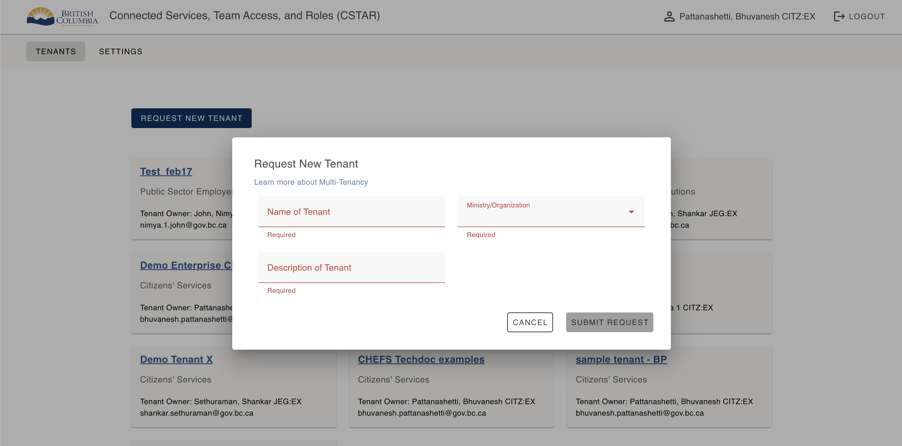
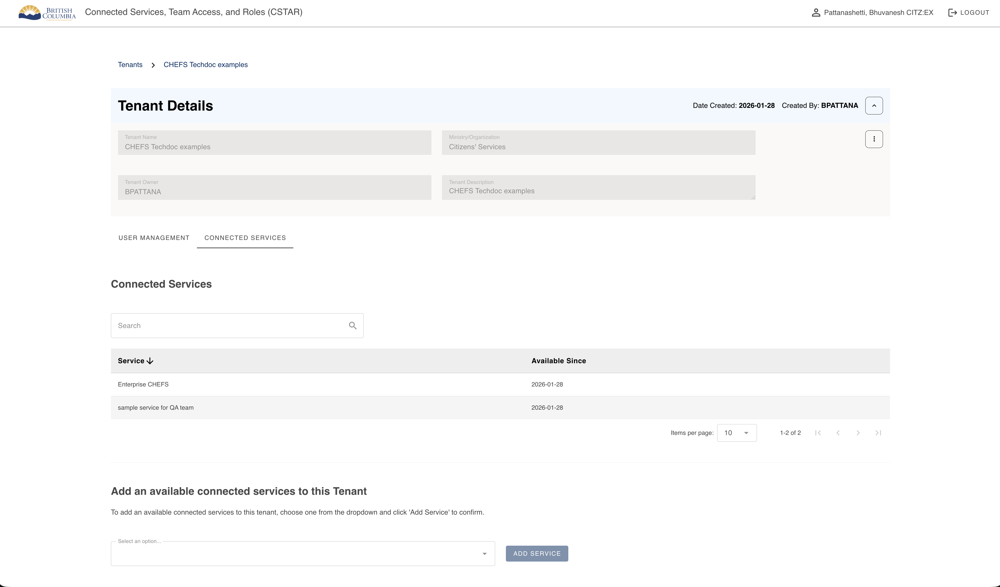
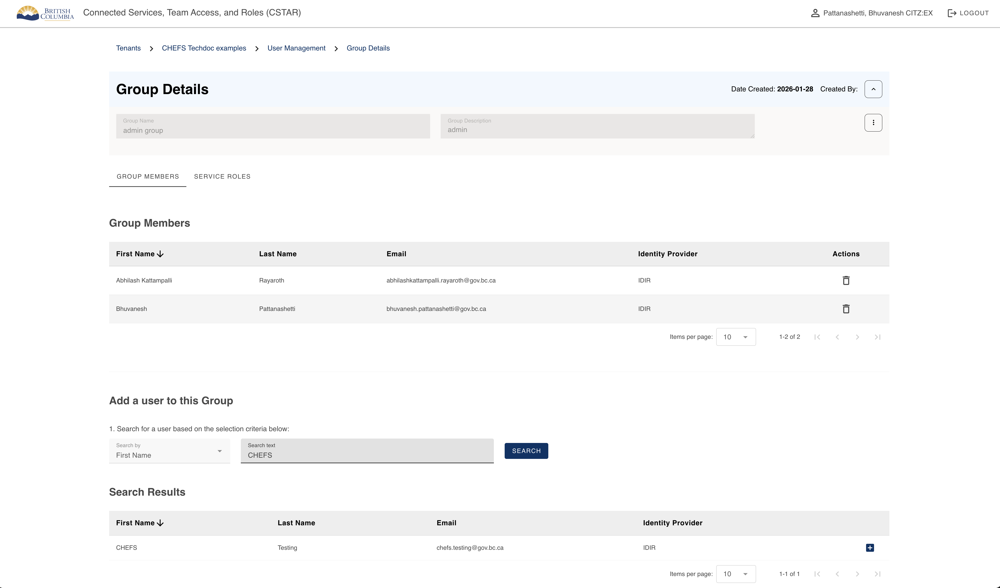
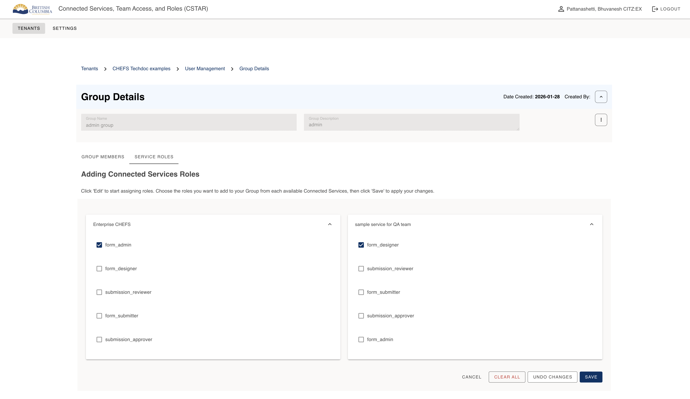

[Home](../index) > [Enterprise CHEFS](index) > **Introduction to CSTAR**
***

CSTAR is the access and role management application used with Enterprise CHEFS and other connected services.

## What is CSTAR?

CSTAR (Connected Services Team Access and Roles) provides a centralized way to:

- create and manage tenants
- manage tenant membership
- organize users into groups
- assign and maintain role-based access

## What is a Tenant?

A tenant represents a program area, initiative, or service team. In Enterprise CHEFS, forms are scoped to the tenant context instead of an individual-only context.

## What are Groups?

Groups are collections of users inside a tenant. They make role assignment repeatable and easier to maintain.

## What are Roles?

Roles determine what actions a user can perform. Roles are applied through groups and reflect service responsibilities.

### 8.1 Requesting a Tenant

Tenants are created through CSTAR. Any user can request a new tenant by clicking **Request New Tenant** on the CSTAR Tenants dashboard. The request requires a tenant name, a ministry or organization, and a description. Once submitted, the request goes to an operations admin for approval.

## Connecting Enterprise CHEFS to a Tenant

Enterprise CHEFS must be added as a connected service to a tenant in CSTAR before roles can be assigned. This is done from the **Connected Services** tab on the Tenant Details page in CSTAR. Once Enterprise CHEFS is connected, its roles become available for assignment to groups within that tenant.

## Adding Users and Creating Groups

Once a tenant is approved and active, the tenant owner can add users to the tenant and create groups. Groups are used to organize users and assign them service roles from Enterprise CHEFS. Users added to a group inherit all roles assigned to that group.

## Assigning Roles to Groups

Roles are assigned to groups from the **Service Roles** tab on the Group Details page in CSTAR. The tenant admin clicks **Edit**, selects the desired roles from the Enterprise CHEFS connected service, and saves. All members of that group will then have those roles when accessing Enterprise CHEFS under the tenant.

***
[Terms of Use](../About/Terms-of-Use) | [Privacy](../About/Privacy) | [Security](../About/Security) | [Service Agreement](../About/Service-Agreement) | [Accessibility](../Capabilities/Accessibility)
