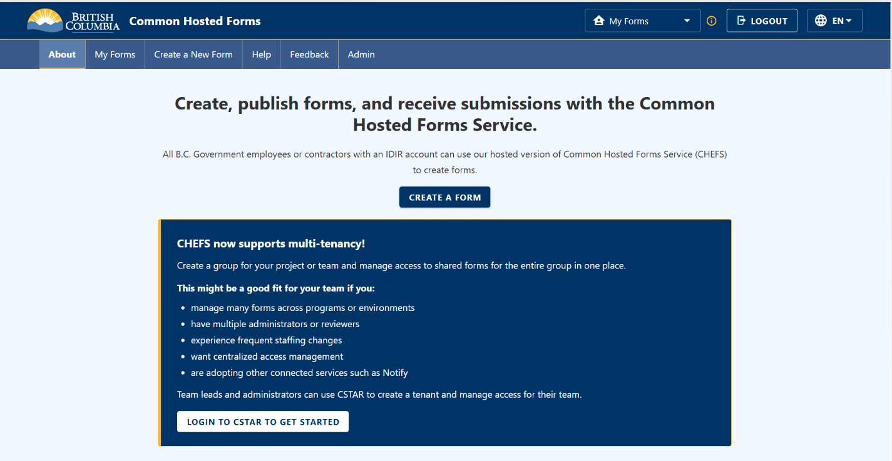
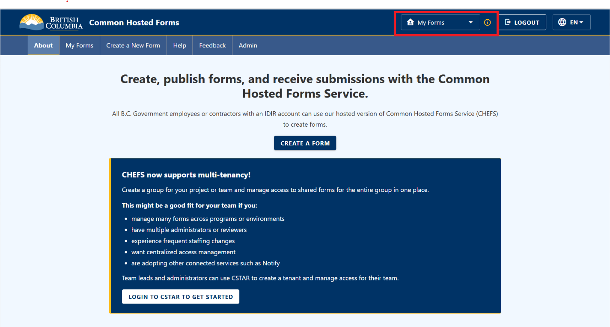
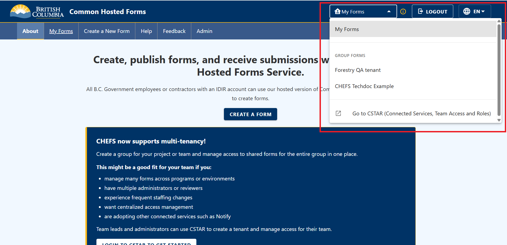
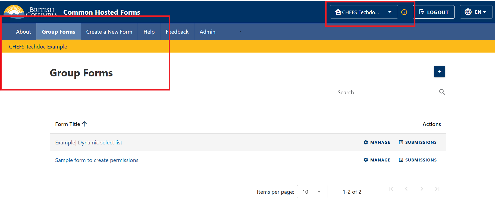
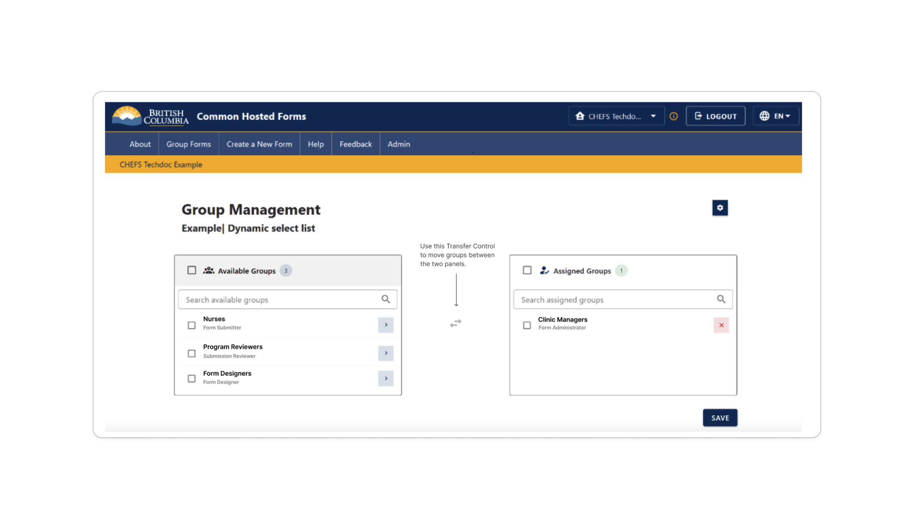
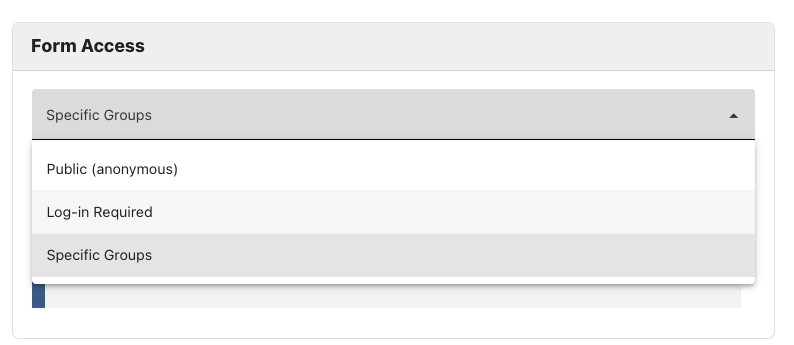
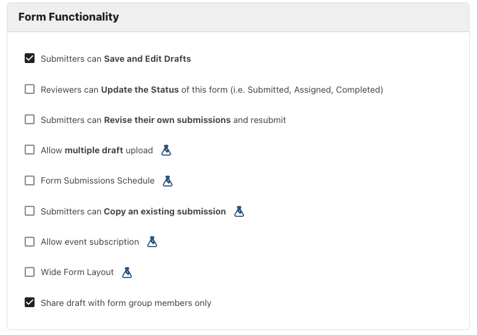
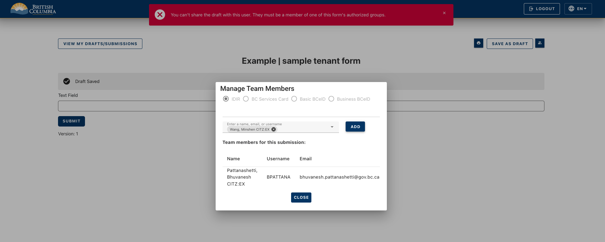

[Home](../index) > [Group Forms](index) > **Features and Use Cases**
***

## About Page

Users log in to CHEFS as usual — there is no separate landing page or gateway for Group Forms. After logging in, the user lands on the **About** page, which now includes a promo box introducing multi-tenancy:

- A summary of who Group Forms is a good fit for (managing many forms across programs or environments, multiple administrators or reviewers, frequent staffing changes, centralized access management, or adopting other connected services such as Notify)
- A **Login to CSTAR to Get Started** button for team leads and administrators who want to set up a tenant

> **Note:** Group Forms is only available to IDIR-authenticated users. BCeID users are not supported for tenants and cannot use Group Forms.

## Logging In

Only users with an IDIR or Business BCeID account who have been granted access through CSTAR can access and manage Group Forms. Basic BCeID users may still be able to log in and submit forms if they have been granted **Form Submitter** access.

---

## My Forms vs Group Forms

### Default State — My Forms

After logging in, users are taken to the **My Forms** page by default. **My Forms** will appear as the selected option in the drop-down menu at the top of the page. This is the classic CHEFS experience — forms are personal and not associated with any tenant.

If a user is not a member of a CSTAR tenant, their CHEFS experience will remain unchanged.

### Switching to a Tenant

If the user belongs to one or more tenants, those tenants are listed in the top-right dropdown under a **Group Forms** section, below the default **My Forms** option. Clicking a tenant switches the application to that tenant's context.

When a tenant is selected:

- A context yellow banner showing the tenant's name appears below the navigation bar
- The Forms page title updates to **Group Forms**, and now lists forms that belong to the selected tenant
- CSTAR is called in the background to retrieve the user's groups and roles within that tenant
- Users can only access forms that have been assigned to one of their groups by a Form Administrator.

---

## Roles and Permissions

Roles and Permissions (How Access Works)

Access to forms is managed through CSTAR groups and roles.

The groups you belong to determine which forms you can access. The role assigned to your group determines what actions you can perform on those forms.

**Example:**

A Flu Shot Clinic may create the following groups:

Clinic Managers — Form Administrator
Nurses — Form Submitter
Clerks — Submission Reviewer
Senior Nurses — Form Submitter

A Group Form called “Patient Intake” may be assigned to the **Nurses** and **Clerks** groups. Users in those groups can submit responses to the form and review submissions, respectively.

Another Group Form called “Adverse Event Follow-up” may be assigned only to the **Senior Nurses** group. Users in that Group can access and submit responses to that form.

### Available Roles

The following roles are available in Group Forms, from most restricted to most permissive:

| Role | Description |
| --- | --- |
| `form_submitter` | Can submit forms. |
| `submission_reviewer` | Can review form submissions. |
| `submission_approver` | Can approve form submissions. |
| `form_designer` | Can create and design forms. |
| `form_admin` | Full access — create forms, manage settings, and view all submissions. |

> **Note:** You will only see forms that have been made available to the groups you belong to. If you cannot find a form, you may not have access to it.

> Note: Only users with the Form Administrator role can create new forms within a tenant.

---

## Managing Forms

Once a tenant is selected, the **Group Forms** page displays all forms belonging to that tenant. The forms available to you, and the actions you can perform on them, depend on your assigned role and group membership.

### Group Management

Form Administrators can control which groups have access to a form.

While users may belong to the same tenant, not all forms need to be available to everyone. The **Group Management** page allows Form Administrators to grant access to specific forms for specific groups.

When a Form Administrator creates a new Group Form, the form is automatically assigned to one of the CSTAR groups they belong to. No other CSTAR groups are granted access by default

This helps ensure that access is granted intentionally and reduces the risk of making forms available to users who do not require access.

If additional CSTAR groups need access to the form, the Form Administrator can add them through the **Group Management** page, where there are two lists:

**Available Groups** – groups that do not currently have access to the form.
**Assigned Groups** – groups that currently have access to the form.

Move a group from **Available Groups** to **Assigned Groups** to grant access to the form. To remove access, move it back to **Available Groups**.

Select **Save** to apply your changes.

> **Note:** Only users with the Form Administrator role can assign or remove groups from a form.

### Form Access — Specific Groups

When configuring a form, a `Form Administrator` can control who can access it using the **Form Access** setting. In Group Forms, in addition to the standard access options available in My Forms, the form can be restricted to **Specific Groups**.

The available options are:

- **Public (anonymous)** — anyone can access the form without logging in
- **Log-in Required** — any authenticated user can access the form
- **Specific Groups** — only users who belong to a CSTAR group that has been assigned to this form can access it

When **Specific Groups** is selected, a user's effective roles on the form are aggregated from all their CSTAR groups that are assigned to that form. For example, if a user belongs to both a `reviewers` group and a `submitters` group, and both are assigned to the form, they will hold the combined roles of both groups on that form.

> **Tip:**: Use CSTAR groups to manage access for broad teams or roles within your tenant, such as Administrators, Designers, Reviewers, or Program Staff.
If a specific form requires more restricted access, create a dedicated CSTAR group and assign that group to the form. This helps keep your group structure simple while allowing access to be managed at the form level when needed.

### Draft Sharing with Specific Groups

CHEFS allows submitters to save a draft and share it with other users so they can collaborate on completing the form before final submission. See [Sharing a Submission](https://developer.gov.bc.ca/docs/default/component/chefs-techdocs/Capabilities/Form-Management/Sharing-a-submission/) for general draft sharing behaviour.

In Group Forms, Form Administrators can limit draft sharing to users who belong to groups that have access to the form. If a user tries to share a draft with someone outside those groups, an error message will be displayed.

---

## End-to-End Flow

The following summarizes how users access and work with Group Forms:

1. Sign in to CHEFS using your IDIR account.
2. After signing in, you will land on the About page.
3. If you are not a member of any tenants in CSTAR, your CHEFS experience will remain unchanged.
4. If you belong to one or more tenants, those tenants will appear in the drop down list at the top of the screen.
5. Select a tenant to access the forms available within that tenant.
6. The forms you can see depend on the groups you belong to and the access assigned to those groups.
7. Your role determines what actions you can perform on each form, such as submitting, reviewing, approving, designing, or managing forms.
8. If you do not see a form that you expect to access, the form may not have been assigned to one of your groups.

***
[Terms of Use](../About/Terms-of-Use) | [Privacy](../About/Privacy) | [Security](../About/Security) | [Service Agreement](../About/Service-Agreement) | [Accessibility](../Capabilities/Accessibility)
